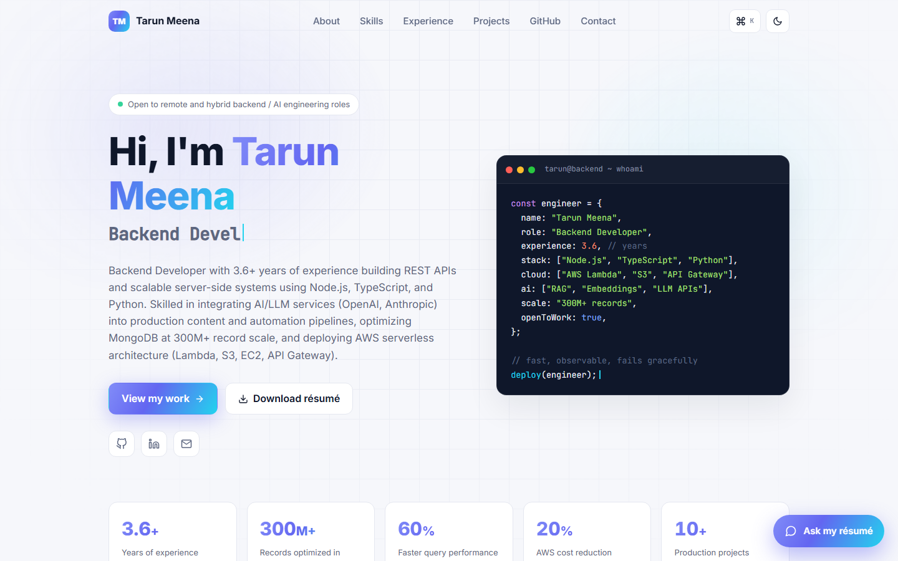
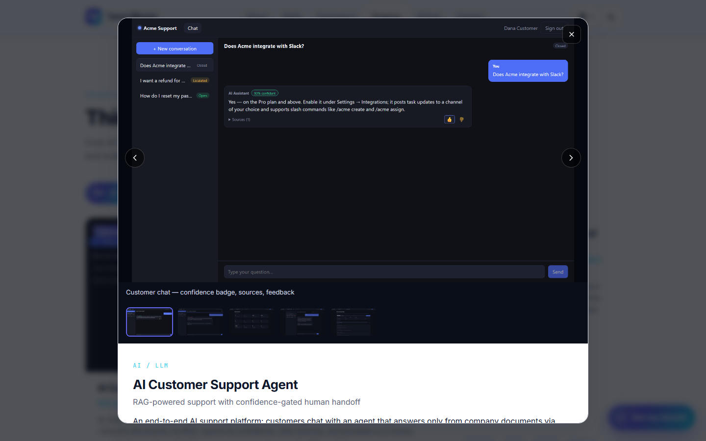
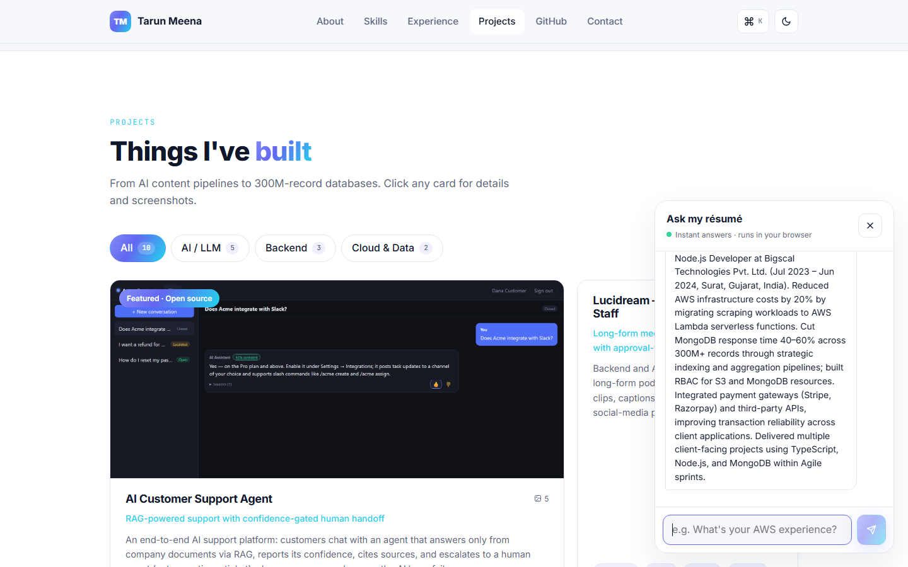
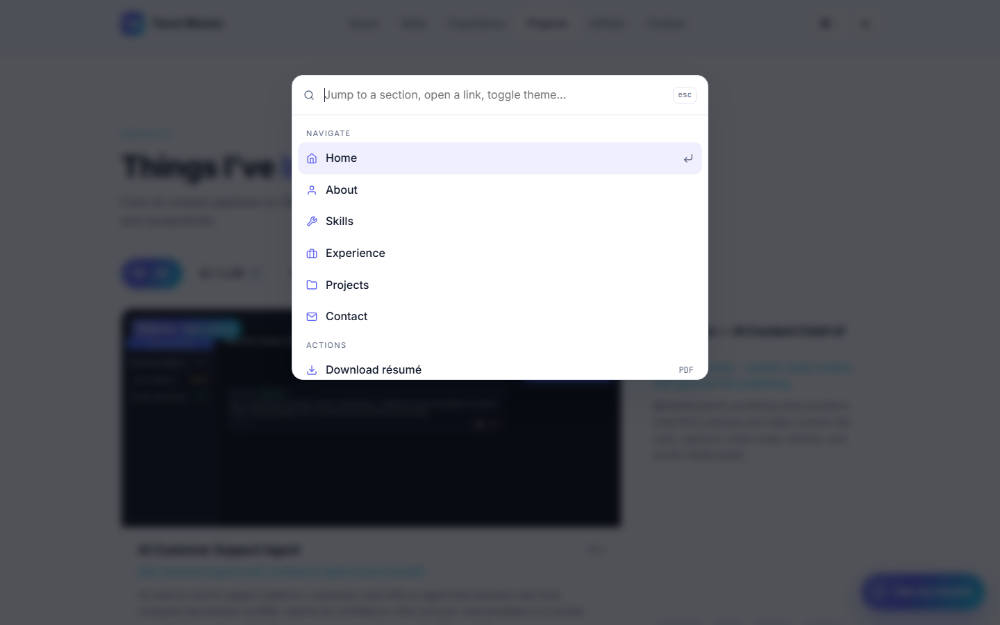

# Tarun Meena — Portfolio

**Live:** https://portfolio-eight-rho-uhm3tf2yjl.vercel.app

Personal portfolio site for a backend developer specialising in Node.js, Python,
AWS serverless, and AI/LLM integration. Built with React + Vite; deploys as a
static site anywhere (Vercel, Netlify, GitHub Pages).

## Features

- **Live GitHub repos** — pulls real repositories from the GitHub API at runtime.
- **"Ask my résumé" assistant** — an in-browser Q&A chat over the résumé data
  (keyword-scored retrieval, no server or API key needed).
- **Command palette** — `Ctrl/⌘ + K` to jump to sections, copy email, toggle
  theme, or open links; full keyboard navigation.
- **Filterable projects with screenshot galleries** — the featured AI Customer
  Support Agent opens a modal with a five-image gallery (arrow-key navigation).
- Dark / light theme (remembers your choice), typewriter hero, animated
  count-up stats, scroll-reveal animations, scroll-spy navigation, experience
  timeline, contact form (mailto), SEO/Open Graph tags, responsive layout.

## Run locally

```powershell
cd portfolio
npm install
npm run dev        # http://localhost:5173
```

## Customise

- **All content lives in one file:** `src/data/resume.js` — profile, stats,
  skills, experience, projects, education, nav links. Edit it and the whole site
  updates.
- **Résumé PDF:** drop your PDF at `public/Tarun_Meena_Resume.pdf` (the
  "Download résumé" button and the palette action point there).
- **Screenshots:** `public/screenshots/` — referenced from `resume.js`.
- **Colours / fonts:** CSS variables at the top of `src/styles.css`.

## Deploy

**Vercel / Netlify (recommended):** import the repo, framework = Vite, build
command `npm run build`, output directory `dist`. Done.

**GitHub Pages:** build with the repo name as the base path, then publish `dist/`:

```powershell
$env:VITE_BASE="/portfolio/"; npm run build
```

## Tech

React 18 · Vite 5 · react-icons · plain CSS (custom properties, no framework)

## Screenshots

| Hero | Project gallery |
|---|---|
|  |  |

| "Ask my résumé" assistant | Command palette (Ctrl+K) |
|---|---|
|  |  |
